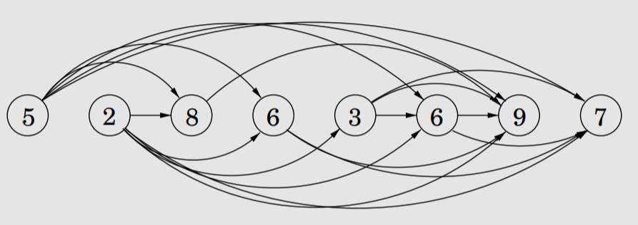

### Algorithm Analysis and Design
### Pratyay Suvarnapathaki, 2020111016
# Week 5, Lecture 2

## Dynamic Programming
In contrast to divide-and-conquer and greedy paradigms, dynamic programming is applicable to a much more general set of problems.\
Unlike the greedy approach, which requires the problem to follow the Greedy Choice Property, as well as the Optimum Substructure Property, dynamic programming only requires the problem to obey the latter, because it involves **dividing the problem into subproblems, and tackling them, in a 'smallest first' manner**.\
Here, the program efficiency is in fact improved if there is a lot of overlap between problems, because we can keep track of prior-solved problems using memoization techniques.

---

## The Shortest Path in a DAG Problem
To truly understand the idea/rationale behind Dynamic Programming, it is useful to analyze this problem where the objective is to find the shortest path between a source and a destination node in the given directed acyclic graph(DAG), as efficiently as possible.\
Yes this is doable using say Dijkstra's algorithm. However, DAGs are special because unlike a regular graph, they can be linearized, i.e. *a topogical sorting always exists for a DAG*.


For instance, consider the above diagram depicting a DAG and its linearized form.\
Let $S$ be the source node and $E$ be the destination.\
Let `path(node)` denote the *minimum distance from $S$ to the `node`*\
As the only two ways to get to $E$ are from $D$ and $B$, we can say:\
`dist(E)=min{dist(D)+1 , dist(B)+2}`
Thus, going from left to right, we can say that, when we pass over node $V$, we already know how to find `dist(V)`\
Algorithm to find the shortest path:
```py
dist[*] = maxint
dist[s] = 0
for each v in Vertices, in linearlized order:
	if(isEdge(u,v)&&v!=s)
	dist[v]=min(dist[u]+weight(u,v))
```
Thus, the shortest path is found in a single pass.

---

## DAGs and DP
If we analyze what we did in the above problem, we essentially:
- Started with the **smallest** subproblem, i.e. finding `dist(source)`, which we know to be $0$.
- We then solved incrementally larger subproblems, beginning with nodes that are directly connected to $S$ and so on...
Here, we can proceed with the more complex problem only when we have solved the smaller problem preceding it.\
In essence, this paradigm of solving problems, not just this problem, but general computational problems, is called **Dynamic Programming**.\
Just as we found out the shortest path in a DAG in the above problem, just by tweaking the condition, we can easily find the *longest* path in the DAG, and so on...\

The point is, several computational/algorithmic problem form a **conceptual DAG**, wherein the **nodes are subproblems** and there exists a directed edge between two nodes if for solving the latter we need to have solved the former.

---

## The Longest Increasing Subsequence Problem
The problem statement is quite simple, given an input sequence of numbers $\{a_1,\dotsm,a_n\}$,\
the objective is to find the longest subsequence $a_{i_1}\lt\dotsm\lt a_{i_k}$ such that $1\leq i_1\lt \dotsm \lt i_k \leq n$.\
For example, the longest increasing subsequence (LIS) of $5,2,8,6,3,6,9,7$ is $2,3,6,9$.

### Visualising this as a DAG
We create a node $i$ corresponding to each input number $a_i$, and allow an edge between $a_i$ and $a_j$ if a increasing subsequence is allowed from the former to the latter, i.e. if $i\lt j$ and $a_i \lt a_j$. Give each such edge the weight $1$.\
Here is a diagram showing a topologically sorted representation of such a DAG:



As there is clearly one-one correspondence between paths in the above diagram and all the possible increasing subsequences, we can assert that the **longest path must be the required LIS**.\
Now,\
Let $L(j)$ denote the LIS ending at index $j$.\
Our required answer is the `max` among the collection $\{L(j):1\leq j \leq n\}$\
This is an ordering where *smaller subproblems earlier*, hence, the DP approach is followed.\
Here, we can solve the subproblems using the relation:\
`L(j) = 1 + max{ L(i) : (i,j) is an edge }`

Algorithm:
```py
for j in range(1,n+1):
	for all i if(isEdge(i,j)):
		L[j]=1+max(L(i))
return max_j(L[j])
```

---
